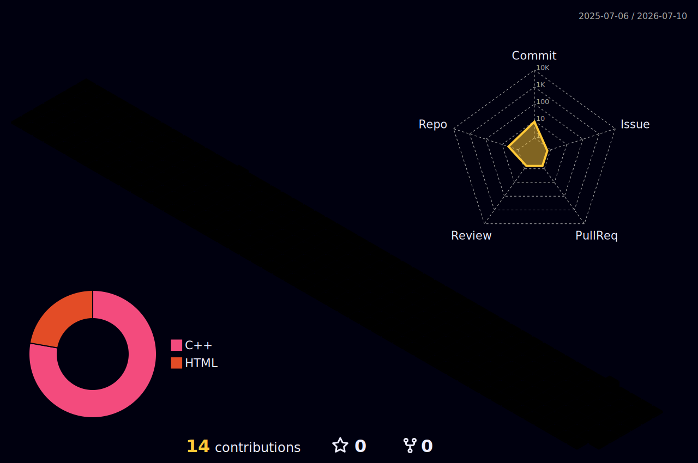

<div align="center">


[](https://git.io/typing-svg)


</div>

<div align="center">



</div>

<table>
<tr>
<td valign="top" width="50%">

```yaml
aniket@github
─────────────────────────────────────
OS: ..................... Mumbai, India
Role: .................... Co-Founder @ Adtekro
Field: ................... B.Tech CSE (AI/ML), 2nd Year
Base: ..................... Mumbai, India

Focus.Primary: ........... DSA (C++) | Coding
Focus.Secondary: ......... ML Projects | Open Source
Goal: ..................... Microsoft / Google Internship

Background: .............. Filmmaking, Video Editing,
                            Content Creation

Languages.Programming: ... C++, Java, Python
Languages.Web: ........... HTML, CSS, JavaScript

Tools: .................... VS Code, MSYS2/GCC, Git

─────────────────────────────────────
Contact
Instagram: ............... @whyanikett
Company: .................. Adtekro
─────────────────────────────────────
```

</td>
<td valign="top" width="50%">

### 🚀 What I'm Doing

- 🎯 Grinding **DSA** with the LeetCode
- 🏗️ Co-building **Adtekro** — a digital agency for marketing + web/app dev
- 🎥 Creating cinematic, story-driven content on Instagram and Youtube

### 🛠️ Tech Stack


</td>
</tr>
</table>

<div align="center">
  
### 🌐 Connect With Me
[](https://instagram.com/whyanikett)

</div>
